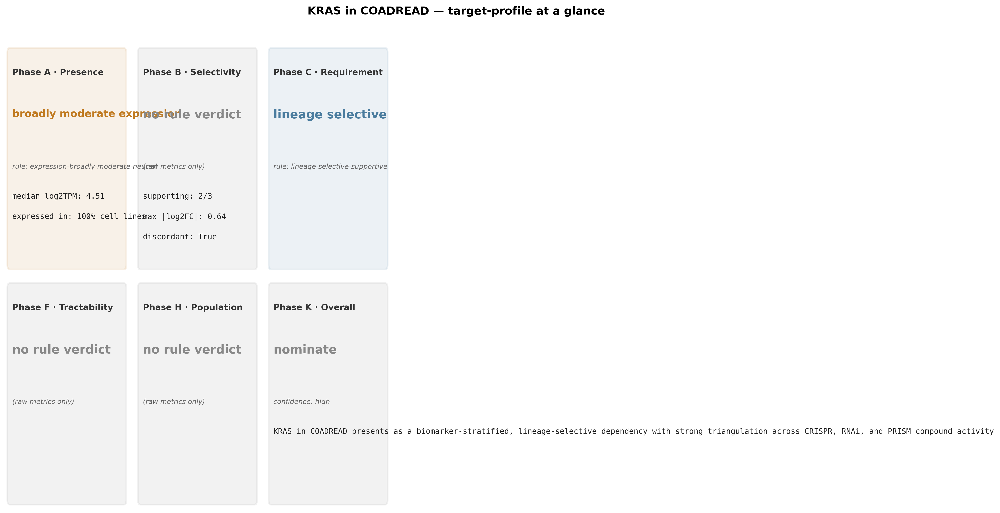

# Target profile — KRAS in COADREAD

Generated 2026-07-14T04:33:07+00:00

## Executive summary *(LLM-synthesized)*

KRAS in COADREAD presents as a biomarker-stratified, lineage-selective dependency with strong triangulation across CRISPR, RNAi, and PRISM compound activity. Hotspot mutants (G12D, G12V, G13D, G12C, A146T) collectively account for ~42% of COADREAD samples and show a large dependency delta (Δchronos ≈ -1.32, q≈1e-102) vs. wildtype, with 'own_mut_hotspot' as the dominant predictive feature. Mechanism is well-characterized with PD markers, and small-molecule tractability is validated by clinically active tri-complex and G12C-selective inhibitors (RMC-7977, eliornrasib, daraxonrasib). Expression is broadly moderate and tumor-vs-normal selectivity is discordant, but these dimensions are not decision-drivers here; surface-modality is a killer only if pursuing ADC/TCE (KRAS is intracellular), and safety evidence is missing.

## Recommendation *(LLM-synthesized, enum-constrained)*

- **Action:** `nominate`
- **Confidence:** `high`

## Risk-by-category summary *(deterministic reshape of sub-verdicts)*

Governance-facing 6-category framing mapped from the rule-fired sub-verdicts below. Categories with no wired data return `insufficient_evidence` rather than fabricated risk levels.

| Category | Risk level | Driver |
|---|---|---|
| **biological** | `MEDIUM` | mixed signals across A/B/C |
| **druggability** | `insufficient_evidence` | tractability sub-verdict absent |
| **translational** | `insufficient_evidence` | Phase-J (translational-readiness) placeholder — data not wired |
| **clinical** | `insufficient_evidence` | Phase-E (clinical precedent) placeholder — data feed not wired |
| **safety** | `insufficient_evidence` | Phase-G (on-target-safety) placeholder — HPA + gnomAD cards not wired |
| **commercial** | `insufficient_evidence` | Phase-E (competitive/IP) placeholder — Cortellis/IQVIA not licensed |

## Tension analysis *(LLM-synthesized)*

Minor tension: tumor-vs-normal selectivity is discordant and CPTAC protein shows tumor ≤ normal, which would normally weaken a tumor-antigen thesis — but this is irrelevant for a mutant-selective small-molecule strategy, where the discriminator is hotspot genotype rather than expression differential. The surface_modality 'not_surface' killer is expected and only forecloses ADC/TCE routes, not the small-molecule path that is already clinically validated. Paralog buffering by NRAS (moderate) and cross-RAS co-inhibition is partially reflected in the pan-RAS tri-complex compound MOAs.

## Sub-verdicts *(deterministic, rule-fired)*

| Dimension | Verdict | Driving rule |
|---|---|---|
| expression | `broadly_moderate_expression` | `expression-broadly-moderate-neutral` |
| selectivity | — | (raw metrics; no rule verdict) |
| dependency | `lineage_selective` | `lineage-selective-supportive` |
| mechanism | `well_characterized` | `mechanism-well-characterized-supportive` |
| genomic_alteration | `biomarker_stratified_dependency` | `mutant-strongly-dependent-supportive` |
| differentiation | `both_patterns_present` | `cooccurrence-both-patterns-supportive` |
| tractability_sm | `well_covered` | `e7-triangulated-target-engaged-supportive` |
| surface_modality | `insufficient` | `None` |
| safety | `insufficient` | `None` |

## Per-phase evidence *(deterministic, from card summaries)*

Key metrics inlined from each sub-skill's underlying card summaries. Use these to trace a verdict back to its supporting data.

### expression — `broadly_moderate_expression`

| Metric | Value |
|---|---|
| median log2TPM (pan-cancer) | `4.508` |
| fraction expressed | `0.999` |
| log2FC tumor vs adj | `-0.720` |
| q-value (tumor vs adj) | `3.29e-16` |

### selectivity

| Metric | Value |
|---|---|
| cells supporting | `2.000` |
| cells ran | `3.000` |
| dominant direction | `down` |
| max |log2FC| | `0.640` |
| discordant | `yes` |

### dependency — `lineage_selective`

| Metric | Value |
|---|---|
| CRISPR-RNAi concordance | `strongly_concordant_non_dependent` |

## Top arguments *(LLM-synthesized)*

**For:**
- Biomarker-stratified dependency is very strong: 223 hotspot-mutant lines show median chronos -1.73 vs -0.41 in WT (Δ=-1.32, q=1.7e-102, effect size 0.90), and hotspot mutation is the top predictive feature (RF R²≈0.47).
- COADREAD mutation frequency ~42% with a diverse hotspot spectrum (G12D 10.9%, G12V 9.3%, G13D 7.2%, G12C 3.0%, A146T 2.9%), enabling both allele-specific and pan-KRAS strategies.
- Small-molecule tractability is clinically triangulated: 23 targeting compounds in PRISM with phase 1+ assets (RMC-7977, eliornrasib, daraxonrasib), and CRISPR–PRISM concordance class = triangulated_target_engaged with 20 dual responders enriched in Pancreas/Bowel.
- Bowel is the #2 dependent lineage (CRISPR fraction strongly dependent 0.55, median chronos -1.18; RNAi 0.41), and co-mutation with APC, SMAD4, CDKN2A plus mutual exclusivity with BRAF/EGFR provides clean patient-selection biology.
- Mechanism is well-characterized (71 upstream regulators, 12 downstream effectors, PD marker available), supporting robust PK/PD strategy and combination rationale.

**Against:**
- Tumor-vs-normal selectivity is discordant across comparators and CPTAC COAD protein trends lower in tumor than normal — irrelevant for mutant-selective SM but forecloses any expression-based targeting.
- Surface-modality fit is a hard 'not_surface' killer (intracellular GTPase, EC 3.6.5.2), removing ADC/TCE options entirely.
- On-target safety evidence is missing (no gnomAD LoF constraint data provided) — WT-KRAS coverage by pan-RAS or tri-complex agents is a known liability that this profile does not quantify.
- Paralog buffering by NRAS is moderate (dual-KO effect -1.04), meaning KRAS-selective inhibition may be bypassed by NRAS/HRAS in some contexts — consistent with the pan-RAS MOA of the leading clinical compounds.
- Competitive landscape is crowded (23 compounds targeting KRAS in PRISM including multiple phase 1+ tri-complex and G12C assets), so any new program needs a clear differentiation angle (novel allele, resistance mechanism, or combination).

---

*LLM-synthesized sections carry `_source: llm_synthesized` provenance (see `nomination.json`). Sub-verdicts + per-phase evidence + risk-by-category are deterministic and reproducible from the same inputs. The composite figure is rendered from the same sub-verdicts and can be regenerated identically.*